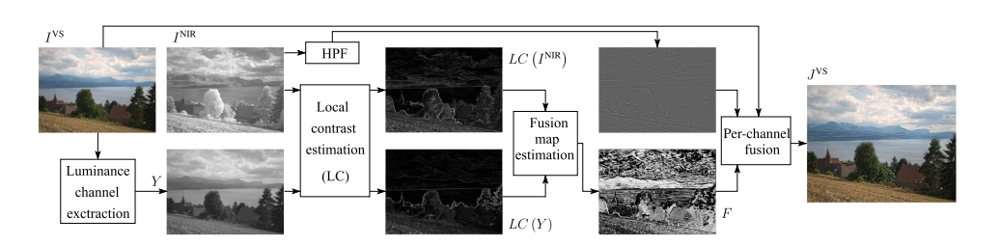
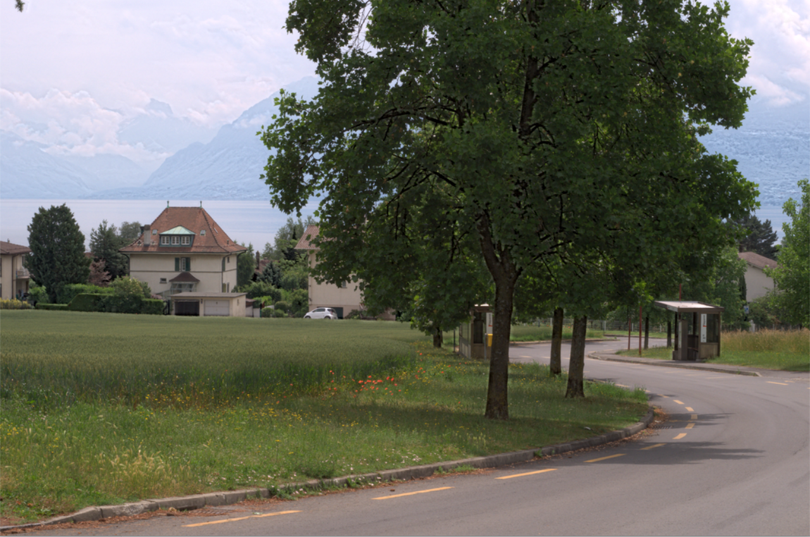
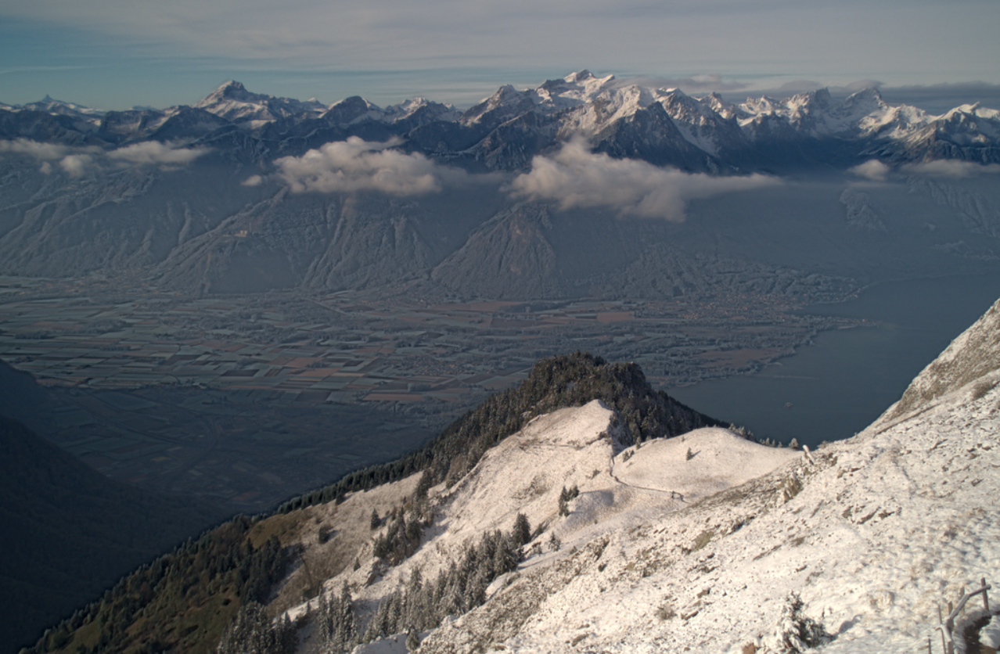

# Adaptive_Near-Infrared_and_Visible_Fusion_for_Fast_Image_Enhancement
implement the paper Adaptive Near-Infrared and Visible Fusion for Fast Image Enhancement

If you can't get the source code provided by the author from http://bit.ly/2raNZPE, you can refer to this version of the code.

Workflow of the method proposed in the paper:

There is a little difference between the code results of this version and the paper results due to the differences in the details of the implementation. You can optimize on this code. Here are some running results:

